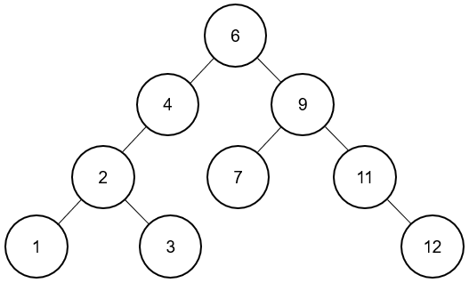
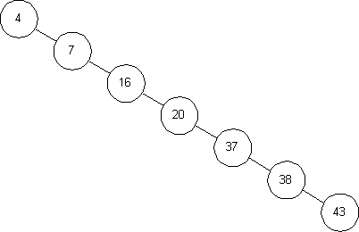
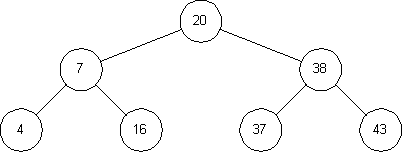
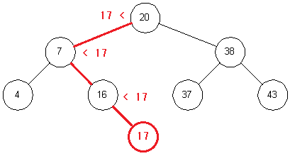

 

### 1. 기술 정의

이진탐색트리란 이진탐색 (Binary Search)와 연결리스트(Linked List)를 결합한 자료구조의 일종이다.

 

|      |                     이진 탐색                      |                     연결 리스트                      |
| :--: | :------------------------------------------------: | :--------------------------------------------------: |
| 장점 | 탐색에 소요되는 시간복잡도가 **O(logN)** 로 빠르다 | 삽입과 삭제에 걸리는 시간 복잡도가 **O(1)**로 빠르다 |
| 단점 |              삽입과 삭제가 불가능하다              |            탐색의 시간 복잡도가 O(N) 이다            |

 

위와 같은 이진 탐색과 연결리스트의 장점을 고안하기 위해 만들어졌으며, **이진 탐색의 효율적인 탐색 능력을 유지하면서도 빈번한 자료 입력과 삭제가 가능하기 위해** 사용된다.

 

---

### 2. 기술 내용

 

	

 

이진탐색트리는 이진트리의 일종으로 다음과 같은 규칙으로 구성한다.

-   모든 노드는 유일한 키를 갖는다 (중복된 노드가 없어야 한다)
-   각 노드의 왼쪽 서브 트리에는 해당 노드의 값보다 작은 값을 지닌 노드들로 이루어져 있다.
-   각 노드의 오른쪽 서브 트리에는 해당 노드의 값보다 큰 값을 지닌 노드들로 이루어져 있다.
-   각 노드의 왼쪽, 오른쪽 서브트리 또한 이진탐색트리로 구성한다.

 

다음은 이진탐색트리가 가진 특징이다.

-   탐색의 시간 복잡도는 트리의 높이를 h라고 할 때 **O(h)** 이다.

     
     
    

    	
    

    > 위와 같은 편향 트리의 경우 탐색에 O(N)의 시간이 소요된다.

     

-   이진탐색 트리의 순회는 중위 순회 (in order) 방식이다. (왼쪽 - 루트 - 오른쪽)

     
     
    

    	
    

     

    > 중위 순회: 4, 7, 16, 20, 37, 38, 43 (중위 순회 방식으로 정렬된 순서를 얻을 수 있다)

     

-   이진탐색트리의 삽입 연산은 루트노드에서 탐색을 시작해 서브트리가 없는 잎새 노드에서 이뤄진다.

     
     
    

    	
    

     

-   이진탐색트리의 삭제 연산은 세가지 케이스로 나눠서 연산한다.

    -   자식 노드가 없는 경우 -> 삭제할 노드를 그냥 없앤다

    -   자식 노드가 하나 있는 경우 -> 삭제할 노드의 자식을 올린다

    -   자식 노드가 두 개 있는 경우 -> 오른쪽 서브 트리에서 가장 작은 값이나 왼쪽 서브 트리에서 가장 큰 값을 올린다.

     

---

### 3. 면접에 나올 수 있는 질문

 

<strong> Q. 이진탐색트리의 탐색 시간복잡도는?</strong>

 

> A. 트리의 높이를 h라고 할 때 **O(h)**이다. 노드의 개수 N이 주어졌을 때 균등 트리 일 경우 O(logN) 이며 편향 트리일 경우 최악의 경우 O(N)이다.

 

<strong> Q. 이진탐색트리의 삽입,삭제 연산 시간복잡도는?</strong>

 

> A. 이진탐색트리의 삽입과 삭제 연산은 탐색이후 이루어지기 때문에 탐색에 필요한 O(h)이 소요되며 연결리스트를 사용하므로 입력과 삭제에는 O(1)이 사용된다.     따라서 총 소요되는 시간 복잡도는 **O(h)**이며 최악의 경우 탐색과 동일하게 O(N)이 소요된다.

 

<strong> Q. 이진탐색트리에 중복이 없어야 하는 이유는? </strong>

 

> A. 이진탐색트리는 검색을 목적으로 하는 자료구조이기 때문에 트리에 중복노드를 허용한다면 검색 속도에 영향을 끼칠 수 있기 때문이다.

 

<strong> Q. 이진탐색트리에 적합하지 않은 트리 형태는? </strong>

 

> A. 이진탐색트리는 검색,삽입,삭제에 O(h)이 소요되기 때문에 한쪽 방향으로 노드가 집중된 편향트리에서는 효율적이지 않다.

 

---

### 4. 참고

 

-   https://ratsgo.github.io/data%20structure&algorithm/2017/10/22/bst/
-   https://idea-sketch.tistory.com/26
-   https://github.com/WooVictory/Ready-For-Tech-Interview/blob/master/Data%20Structure/%5BData%20Structure%5D%20%EC%9D%B4%EC%A7%84%20%ED%83%90%EC%83%89%20%ED%8A%B8%EB%A6%AC.md

 

---

### 5. 기여자

 

	<a href="http://jongminfire.dev">
		
		 
		
			<b>Jongminfire</b>
		
	</a>
	 
	<a href="#platform-Jongminfire" title="Packaging/porting to new platform">
		📦
	</a>

